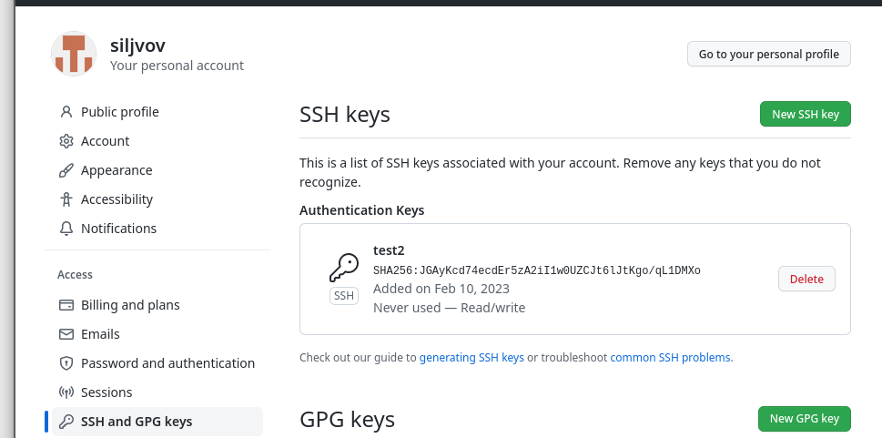
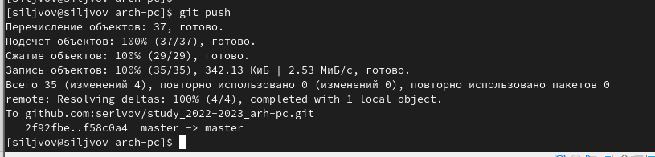

# РОССИЙСКИЙ УНИВЕРСИТЕТ ДРУЖБЫ НАРОДОВ

# Факультет физико-математических и естественных наук

# Кафедра прикладной информатики и теории вероятностей

# ОТЧЕТ

# ПО ЛАБОРАТОРНОЙ РАБОТЕ № 3

*дисциплина:*

*Архитектура компьютера*

Студент: Львов Сергей

Группа: НПИбд-02-22

**МОСКВА**

2022 г.

# Цель работы:

Целью работы является изучить идеологию и применение средств контроля
версий.

Приобрести практические навыки по работе с системой git.

# Порядок выполнения лабораторной работы:

**1. Настройка github.**

Создаём учётную запись на сайте https://github.com/ и заполняем основные
данные (рис. 1).

{width="6.728472222222222in"
height="5.320833333333334in"}

Рис. 1. Учётная запись Github

**2. Базовая настройка git.**

Сначала сделаем предварительную конфигурацию git. Откроем терминал и
введём следющие

команды (рис. 2), указав своё имя и email.

{width="6.728472222222222in"
height="1.7972222222222223in"}

Рис. 2. Имя и email

Настроим utf-8 в выводе сообщений git (рис. 3).

{width="5.540974409448819in"
height="1.1248589238845144in"}

Рис. 3. Настройка вывода сообщений git

Зададим имя начальной ветки, будем называть её master (рис. 4).

{width="6.040910979877515in"
height="1.374828302712161in"}

Рис. 4. Начальная ветка

Параметры autocrlf и safecrlf (рис. 5).

{width="6.0721576990376205in"
height="1.072782152230971in"}

Рис. 5. Параметры autocrlf и safecrlf

**3. Создание SSH ключа.**

Для последующей идентификации пользователя на сервере репозиториев
необходимо

сгенерировать пару ключей (приватный и открытый) (рис. 6).

{width="5.833333333333333in"
height="3.03915135608049in"}

Рис. 6. Генерация ключа

Далее необходимо загрузить сгенерированный ключ (рис. 7).

{width="6.728472222222222in"
height="3.339583333333333in"}

Рис. 7. Загрузка сгенерированного ключа

**4. Создание рабочего пространства и репозитория курса на основе
шаблона.**

При выполнении лабораторных работ будем придерживаться следующей
структуры рабочего

пространства (рис. 8).

{width="2.7083333333333335in"
height="2.0208333333333335in"}

Рис. 8. Структура рабочего пространства

Создадим каталог для предмета «Архитектура компьютера» через терминал
(рис. 9).

{width="6.728472222222222in"
height="1.7166666666666666in"}

Рис. 9. Создание каталога

**5. Создание репозитория курса на основе шаблона.**

Создадим репозиторий на основе шаблона через web-интерфейс github (рис.
10-11).

{width="6.728472222222222in"
height="3.951388888888889in"}

Рис. 10. Использование шаблона репозитория

{width="4.963482064741907in"
height="3.9921970691163606in"}

Рис. 11. Название репозитория

Затем откроем терминал, перейдем в каталог курса и клонируем созданный
репозиторий (рис. 12).

{width="6.728472222222222in"
height="5.167361111111111in"}

Рис. 12. Клонирование созданного репозитория

**6. Настройка каталога курса.**

Перейдем в каталог курса, удалим лишние файлы, создадим необходимые
каталоги и

отправим файлы на сервер (рис. 13-14).

{width="6.728472222222222in"
height="4.228472222222222in"}

Рис. 13. Процесс настройки 1

{width="6.728472222222222in"
height="1.6180555555555556in"}

Рис. 14. Процесс настройки 2

# Описание результатов выполнения заданий для самостоятельной работы:

Поскольку отчёты я делал не на созданной ОС, я их сначала загрузил на
github (рис. 15), затем уже в ОС Linux открыл github, скачал отчёты из
репозитория и разместил их по локальным папкам (рис. 16).

{width="6.728472222222222in"
height="3.1194444444444445in"}

Рис. 15. Загрузка отчетов

{width="6.728472222222222in"
height="5.628472222222222in"}

Рис. 16. Сортировка отчетов в ОС Linux

# Вывод:

Была изучена идеология и применение средств контроля версий, были
приобретены

практические навыки по работе с системой git, а также по работе сайте
https://github.com/.
