---
## Front matter
title: "Отчёт по лабораторной работе 5"
subtitle: "Создание и процесс обработки программ на языке ассемблера NASM."
author: "Львов Сергей	НПИбд-02-22"

## Generic otions
lang: ru-RU
toc-title: "Содержание"

## Bibliography
bibliography: bib/cite.bib
csl: pandoc/csl/gost-r-7-0-5-2008-numeric.csl

## Pdf output format
toc: true # Table of contents
toc-depth: 2
lof: true # List of figures
lot: true # List of tables
fontsize: 12pt
linestretch: 1.5
papersize: a4
documentclass: scrreprt
## I18n polyglossia
polyglossia-lang:
  name: russian
  options:
	- spelling=modern
	- babelshorthands=true
polyglossia-otherlangs:
  name: english
## I18n babel
babel-lang: russian
babel-otherlangs: english
## Fonts
mainfont: PT Serif
romanfont: PT Serif
sansfont: PT Sans
monofont: PT Mono
mainfontoptions: Ligatures=TeX
romanfontoptions: Ligatures=TeX
sansfontoptions: Ligatures=TeX,Scale=MatchLowercase
monofontoptions: Scale=MatchLowercase,Scale=0.9
## Biblatex
biblatex: true
biblio-style: "gost-numeric"
biblatexoptions:
  - parentracker=true
  - backend=biber
  - hyperref=auto
  - language=auto
  - autolang=other*
  - citestyle=gost-numeric
## Pandoc-crossref LaTeX customization
figureTitle: "Рис."
tableTitle: "Таблица"
listingTitle: "Листинг"
lofTitle: "Список иллюстраций"
lotTitle: "Список таблиц"
lolTitle: "Листинги"
## Misc options
indent: true
header-includes:
  - \usepackage{indentfirst}
  - \usepackage{float} # keep figures where there are in the text
  - \floatplacement{figure}{H} # keep figures where there are in the text
---

# Цель работы:

Освоение процедуры компиляции и сборки программ, написанных на
ассемблере NASM.

# Порядок выполнения лабораторной работы:

1.  **Программа Hello world!**

Рассмотрим пример простой программы на языке ассемблера NASM.
Традиционно первая программа выводит приветственное сообщение Hello
world! на экран.

Создадим каталог для работы с программами на языке ассемблера NASM,
перейдем в него, создадим текстовый файл с именем hello.asm и откроем
его (рис. 1).

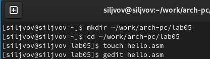

Введём в него следующий текст (рис. 2).

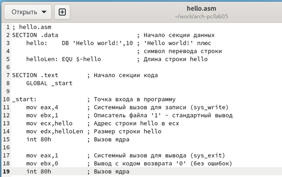

2.  **Транслятор NASM.**

Затем скомпилируем программу Hello world! (рис. 3).

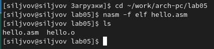

Создался объектный файл, значит компиляция прошла успешно.

3.  **Расширенный синтаксис командной строки NASM.**

Полный вариант командной строки nasm выглядит следующим образом (рис.
4).

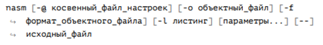

Выполним следующую команду, а затем проверим, что файлы были созданы
(рис. 5).

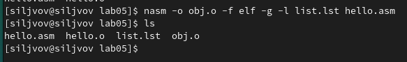

Данная команда скомпилирует исходный файл hello.asm в obj.o (опция - o
позволяет задать имя объектного файла, в данном случае obj.o), при этом
формат выходного файла будет elf, и в него будут включены символы для
отладки (опция -g), кроме того, будет создан файл листинга list.lst
(опция -l).

4.  **Компоновщик LD.**

Чтобы получить исполняемую программу, объектный файл необходимо передать
на обработку компоновщику, затем проверим, что исполняемый файл был
создан (рис. 6).

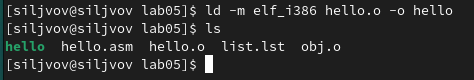

Затем создадим еще один исполняемый файл, как видим, его название стало
main (рис. 7).

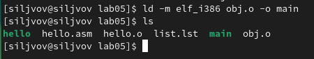

Затем запустим созданный исполняемый файл с помощью следующей команды
(рис. 8).

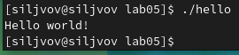

# Порядок выполнения самостоятельной работы:

В том же каталоге создадим копию файла hello.asm с именем lab5.asm и
внесем в него изменения, чтобы программа выводила на экран мои фамилию и
имя (рис. 9-10).

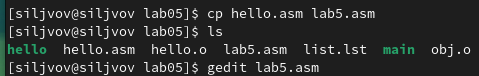

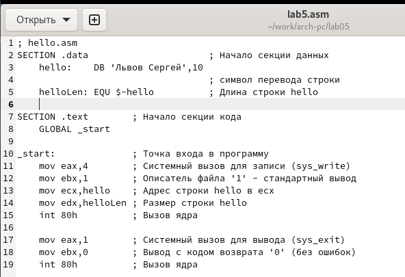

Затем оттранслируем полученный текст программы в объектный файл.
Выполним компоновку объектного файла и запустим получившийся исполняемый
файл (рис. 11).

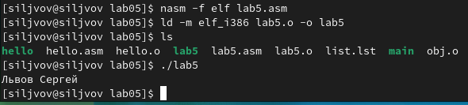

# Вывод:

Во время лабораторной работы были освоены процедуры компиляции и сборки
программ, написанных на ассемблере NASM.
