---
## Front matter
title: "Отчёт по лабораторной работе 6"
subtitle: "Основы работы с Midnight Commander (mc). Структура программы на языке ассемблера NASM. Системные вызовы в ОС GNU Linux"
author: "Львов Сергей	НПИбд-02-22"

## Generic otions
lang: ru-RU
toc-title: "Содержание"

## Bibliography
bibliography: bib/cite.bib
csl: pandoc/csl/gost-r-7-0-5-2008-numeric.csl

## Pdf output format
toc: true # Table of contents
toc-depth: 2
lof: true # List of figures
lot: true # List of tables
fontsize: 12pt
linestretch: 1.5
papersize: a4
documentclass: scrreprt
## I18n polyglossia
polyglossia-lang:
  name: russian
  options:
	- spelling=modern
	- babelshorthands=true
polyglossia-otherlangs:
  name: english
## I18n babel
babel-lang: russian
babel-otherlangs: english
## Fonts
mainfont: PT Serif
romanfont: PT Serif
sansfont: PT Sans
monofont: PT Mono
mainfontoptions: Ligatures=TeX
romanfontoptions: Ligatures=TeX
sansfontoptions: Ligatures=TeX,Scale=MatchLowercase
monofontoptions: Scale=MatchLowercase,Scale=0.9
## Biblatex
biblatex: true
biblio-style: "gost-numeric"
biblatexoptions:
  - parentracker=true
  - backend=biber
  - hyperref=auto
  - language=auto
  - autolang=other*
  - citestyle=gost-numeric
## Pandoc-crossref LaTeX customization
figureTitle: "Рис."
tableTitle: "Таблица"
listingTitle: "Листинг"
lofTitle: "Список иллюстраций"
lotTitle: "Список таблиц"
lolTitle: "Листинги"
## Misc options
indent: true
header-includes:
  - \usepackage{indentfirst}
  - \usepackage{float} # keep figures where there are in the text
  - \floatplacement{figure}{H} # keep figures where there are in the text
---

# Цель работы:

Приобретение практических навыков работы в Midnight Commander. Освоение
инструкций языка ассемблера mov и int.

# Порядок выполнения лабораторной работы:

Откроем Midnight Commander и перейдем в каталог \~/work/arch-pc
созданный при выполнении лабораторной работы №5 (рис.1).

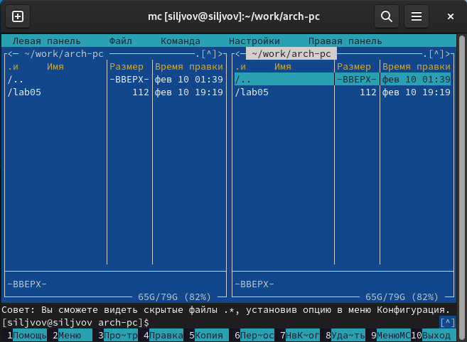

Затем создадим папку lab06 и создадим в ней файл lab6-1.asm (рис. 2).

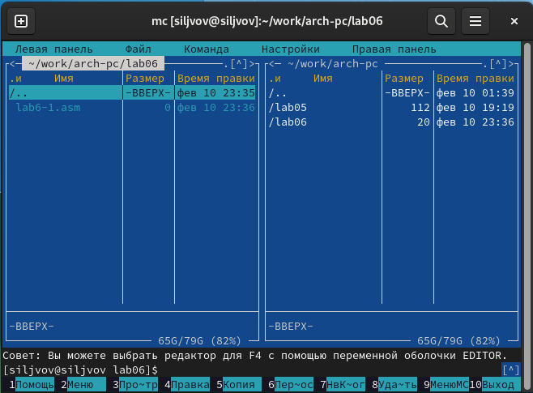

Потом откроем файл lab6-1.asm и введем следующий текст программы (рис.
3.)

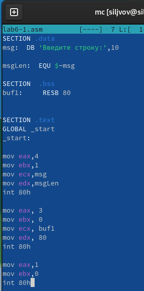

Затем оттранслируем текст программы lab6-1.asm в объектный файл.
Выполним компоновку объектного файла и запустим получившийся исполняемый
файл. Затем на запрос программы введем свои ФИО (рис. 4).

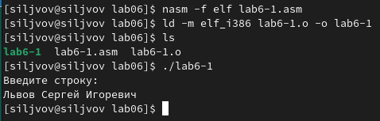

Скачаем файл in_out.asm со страницы курса в ТУИС, чтобы в дальнейшем
упростить нашу жизнь, и переместим его в каталог с файлом lab6-1.asm
(рис. 5).

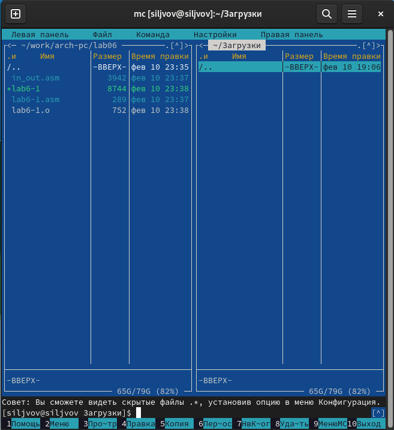

Создадим копию файла lab6-1.asm с именем lab6-2.asm (рис. 6). Затем
исправим текст программы в файле lab6-2.asm с использованием подпрограмм
из внешнего файла in_out.asm (рис. 7). Создадим исполняемый файл и
проверим его работу (рис. 8)

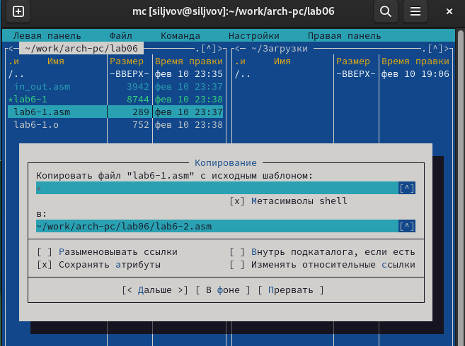

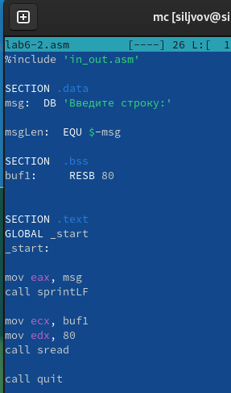

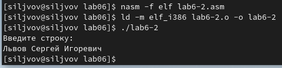

Затем в этом же файле заменим подпрограмму sprintLF на sprint и затем
запустим (рис. 9).

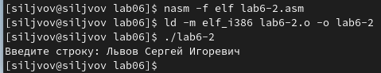

И видим, что по сравнению со sprintLF с подпрограммой sprint нет
переноса строки после вывода строки программы.

# Порядок выполнения самостоятельной работы:

Создадим копию файла lab6-1.asm и назовем его lab6-1_1.asm. Внесем
изменения в программу, так чтобы она после ввода выводила напечатанную
строку (рис. 10). И запустим её (рис. 11).

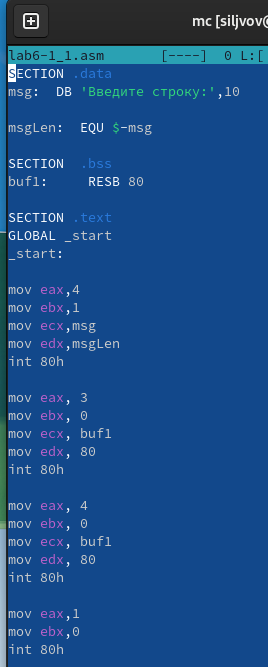

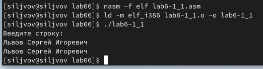

Затем проделаем этот процесс со второй программой (рис. 12-14).

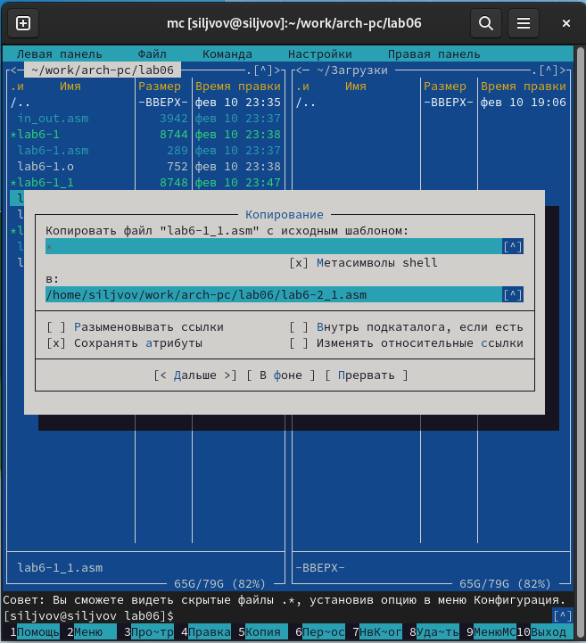

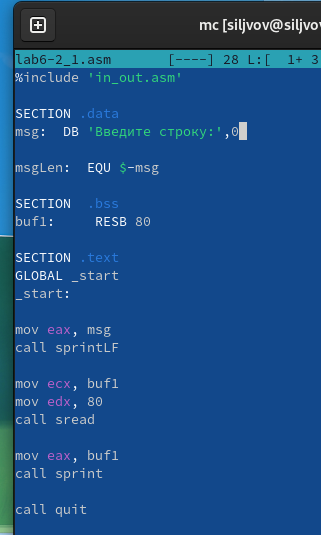

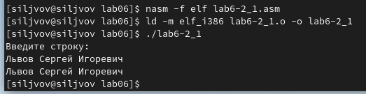

# Вывод:

Во время выполнения лабораторной работы были приобретены практические
навыки работы в Midnight Commander, а также освоены инструкции языка
ассемблера mov и int.
