---
## Front matter
title: "Отчёт по лабораторной работе 7"
subtitle: "Арифметические операции в NASM."
author: "Львов Сергей	НПИбд-02-22"

## Generic otions
lang: ru-RU
toc-title: "Содержание"

## Bibliography
bibliography: bib/cite.bib
csl: pandoc/csl/gost-r-7-0-5-2008-numeric.csl

## Pdf output format
toc: true # Table of contents
toc-depth: 2
lof: true # List of figures
lot: true # List of tables
fontsize: 12pt
linestretch: 1.5
papersize: a4
documentclass: scrreprt
## I18n polyglossia
polyglossia-lang:
  name: russian
  options:
	- spelling=modern
	- babelshorthands=true
polyglossia-otherlangs:
  name: english
## I18n babel
babel-lang: russian
babel-otherlangs: english
## Fonts
mainfont: PT Serif
romanfont: PT Serif
sansfont: PT Sans
monofont: PT Mono
mainfontoptions: Ligatures=TeX
romanfontoptions: Ligatures=TeX
sansfontoptions: Ligatures=TeX,Scale=MatchLowercase
monofontoptions: Scale=MatchLowercase,Scale=0.9
## Biblatex
biblatex: true
biblio-style: "gost-numeric"
biblatexoptions:
  - parentracker=true
  - backend=biber
  - hyperref=auto
  - language=auto
  - autolang=other*
  - citestyle=gost-numeric
## Pandoc-crossref LaTeX customization
figureTitle: "Рис."
tableTitle: "Таблица"
listingTitle: "Листинг"
lofTitle: "Список иллюстраций"
lotTitle: "Список таблиц"
lolTitle: "Листинги"
## Misc options
indent: true
header-includes:
  - \usepackage{indentfirst}
  - \usepackage{float} # keep figures where there are in the text
  - \floatplacement{figure}{H} # keep figures where there are in the text
---

# Цель работы:

Освоение арифметических инструкций языка ассемблера NASM.

# Порядок выполнения лабораторной работы:

**Символьные и численные данные в NASM.**

Создадим каталог для программ лабораторной работы №7, перейдем в него и
создадим файл lab7-1.asm (рис. 1).

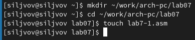

Затем рассмотрим примеры программ вывода символьных и численных
значений. Программы будут выводить значения, записанные в регистр eax.

Введем в файл lab7-1.asm текст программы (рис. 2). В данной программе в
регистр eax записывается символ 6 (mov eax,\'6\'), в регистр ebx символ
4 (mov ebx,\'4\'). Далее к значению в регистре eax прибавляем значение
регистра ebx (add eax,ebx, результат сложения запишется в регистр eax).
Далее выводим результат. Так как для работы функции sprintLF в регистр
eax должен быть записан адрес, необходимо использовать дополнительную
переменную. Для этого запишем значение регистра eax в переменную buf1
(mov \[buf1\],eax), а затем запишем адрес переменной buf1 в регистр eax
(mov eax,buf1) и вызовем функцию sprintLF.

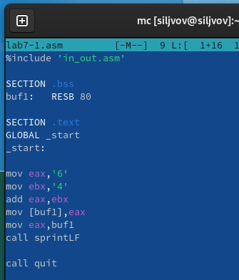

Затем создадим исполняемый файл и запустим его (рис. 3).

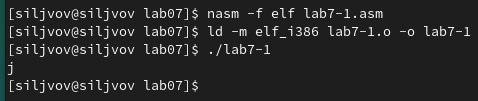

В данном случае при выводе значения регистра eax мы ожидаем увидеть
число 10. Однако результатом будет символ j. Это происходит потому, что
код символа 6 равен 00110110 в двоичном представлении (или 54 в
десятичном представлении), а код символа 4 -- 00110100 (52). Команда add
eax,ebx запишет в регистр eax сумму кодов -- 01101010 (106), что в свою
очередь является кодом символа j (см. таблицу ASCII).

Далее изменим текст программы и вместо символов, запишем в регистры
числа (рис. 4).

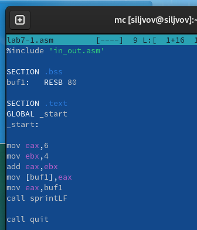

Создадим исполняемый файл и запустим его (рис. 5).

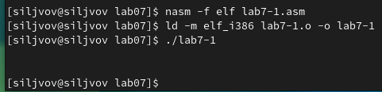

Как и в предыдущем случае при исполнении программы мы не получим число
10, в данном случае выводится символ с кодом 10, этому коду
соответствует управляющий символ перевода строки.

Для работы с числами в файле in_out.asm реализованы подпрограммы для
преобразования ASCII символов в числа и обратно. Преобразуем текст
программы с использованием этих функций. Создадим файл lab7-2.asm и
введем в него следующий текст (рис. 6).

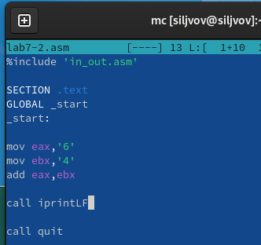

Создадим исполняемый файл и запустим его (рис. 7).

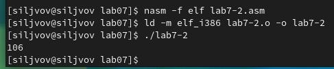

В результате работы программы мы получим число 106. В данном случае, как
и в первом, команда add складывает коды символов '6' и '4' (54+52=106).
Однако, в отличии от программы из листинга 7.1, функция iprintLF
позволяет вывести число, а не символ, кодом которого является это число.

Аналогично предыдущему примеру изменим символы на числа (рис. 8).

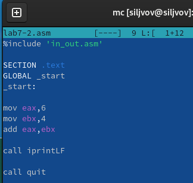

В итоге при выполнении программы получился следующий результат (рис. 9).

Заменим функцию iprintLF из рис. 8 на iprint (рис. 10).

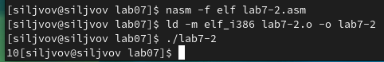

Отличие команды iprint от iprintLF заключается в том, что команда iprint
не переводит строку.

**Выполнение арифметических операций в NASM.**

В качестве примера выполнения арифметических операций в NASM приведем
программу вычисления арифметического выражения 𝑓(𝑥) = (5 `*` 2 + 3)/3.

Создадим файл lab7-3.asm в каталоге ~/work/arch-pc/lab07 и введем в
него следующий текст (рис. 11).

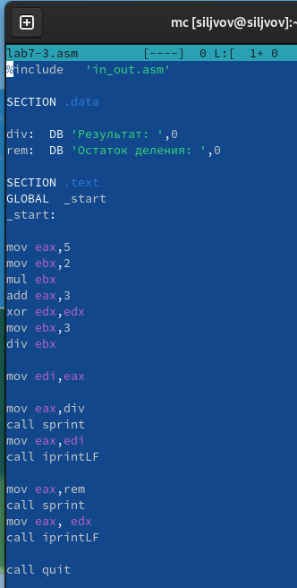

Создадим исполняемый файл и запустим программу (рис. 12).

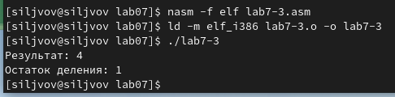

Изменим текст программы для вычисления выражения 𝑓(𝑥) = (4 `*` 6 + 2)/5
(рис. 13). Затем создадим файл и проверим его работу (рис. 14).

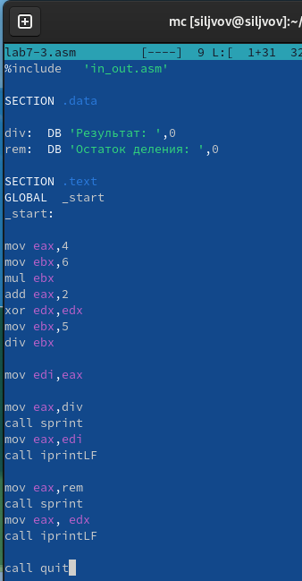

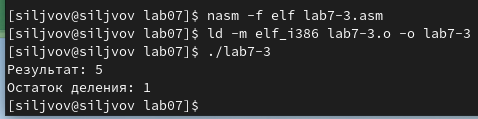

В качестве другого примера рассмотрим программу вычисления варианта
задания по номеру студенческого билета, работающую по следующему
алгоритму:

• вывести запрос на введение № студенческого билета

• вычислить номер варианта по формуле: (𝑆𝑛 mod 20) + 1, где 𝑆𝑛 -- номер
студенческого билета (В данном случае 𝑎 mod 𝑏 -- это остаток от деления
𝑎 на 𝑏).

• вывести на экран номер варианта.

В данном случае число, над которым необходимо проводить арифметические
операции, вводится с клавиатуры. Как отмечалось выше ввод с клавиатуры
осуществляется в символьном виде и для корректной работы арифметических
операций в NASM символы необходимо преобразовать в числа. Для этого
используется функция atoi из файла in_out.asm.

Создадим файл variant.asm в каталоге ~/work/arch-pc/lab07 и напишем в
нем код программы (рис. 15).

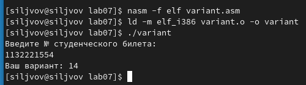

В моем случае вариант для всех следующих заданий будет №14.

Ответы на вопросы:

1.  За вывод на экран сообщения 'Ваш вариант:' отвечают следующие
    строки:

rem: DB 'Ваш вариант: ',0

> mov eax,rem

call sprint

2.  Инструкция nasm используется для преобразования текста программы в
    объектный код; инструкция mov ecx, x используется для записи адреса
    под вводимую строку; инструкция mov edx, 80 используется для
    определения длины вводимой строки; инструкция call sread
    используется для ввода сообщения с клавиатуры.

3.  Инструкция call atoi используется для приобразования ascii-кода
    символа в целое число и записывает результат в регистр eax.

4.  За вычисление варианта отвечают следующие строки кода:

xor edx,edx

mov ebx,20

div ebx

inc edx

5.  Остаток от деления при выполнении инструкции div ebx записывается в
    регистр edx.

6.  Инструкция inc edx используется для увеличения значения регистра edx
    на 1.

7.  За вывод на экран результата вычислений отвечают следующие строки
    кода:

mov eax,edx

call iprintLF

# Порядок выполнения самостоятельной работы:

Напишем программу вычисления выражения, в соответствии с вариантом,
полученным в предыдущем задании - вариант № 14. Выражение будет
следующим: (8𝑥 + 6) `*` 10. Создадим файл function.asm и напишем код (рис.
17).

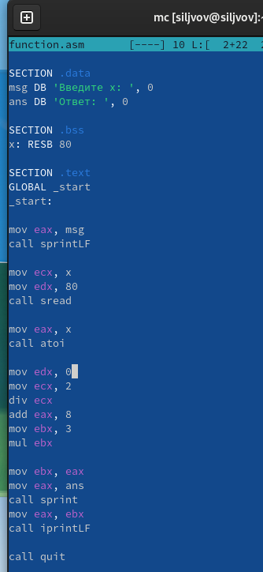

Затем создадим исполняемый файл, запустим программу и проверим его для
значений x1 = 1; x2 = 4 (рис. 18).

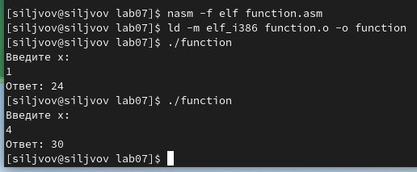

# Вывод:

Во время выполнения лабораторной работы были освоены арифметические
инструкции языка ассемблера NASM: add -- сложение, sub -- вычитание, mul
-- умножение, div -- деление нацело, inc -- увеличение на 1, dec --
уменьшение на 1, neg -- изменение знака числа.
