---
## Front matter
title: "Отчёт по лабораторной работе 9"
subtitle: "Программирование цикла. Обработка аргументов командной строки."
author: "Львов Сергей	НПИбд-02-22"

## Generic otions
lang: ru-RU
toc-title: "Содержание"

## Bibliography
bibliography: bib/cite.bib
csl: pandoc/csl/gost-r-7-0-5-2008-numeric.csl

## Pdf output format
toc: true # Table of contents
toc-depth: 2
lof: true # List of figures
lot: true # List of tables
fontsize: 12pt
linestretch: 1.5
papersize: a4
documentclass: scrreprt
## I18n polyglossia
polyglossia-lang:
  name: russian
  options:
	- spelling=modern
	- babelshorthands=true
polyglossia-otherlangs:
  name: english
## I18n babel
babel-lang: russian
babel-otherlangs: english
## Fonts
mainfont: PT Serif
romanfont: PT Serif
sansfont: PT Sans
monofont: PT Mono
mainfontoptions: Ligatures=TeX
romanfontoptions: Ligatures=TeX
sansfontoptions: Ligatures=TeX,Scale=MatchLowercase
monofontoptions: Scale=MatchLowercase,Scale=0.9
## Biblatex
biblatex: true
biblio-style: "gost-numeric"
biblatexoptions:
  - parentracker=true
  - backend=biber
  - hyperref=auto
  - language=auto
  - autolang=other*
  - citestyle=gost-numeric
## Pandoc-crossref LaTeX customization
figureTitle: "Рис."
tableTitle: "Таблица"
listingTitle: "Листинг"
lofTitle: "Список иллюстраций"
lotTitle: "Список таблиц"
lolTitle: "Листинги"
## Misc options
indent: true
header-includes:
  - \usepackage{indentfirst}
  - \usepackage{float} # keep figures where there are in the text
  - \floatplacement{figure}{H} # keep figures where there are in the text
---

# Цель работы:

Приобретение навыков написания программ с использованием циклов и
обработкой аргументов командной строки.

# Порядок выполнения лабораторной работы:

**Реализация циклов в NASM.**

Создадим каталог для программ лабораторной работы №9, перейдем в него и
создадим нужный файл (рис. 1).

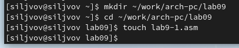

При реализации циклов в NASM с использованием инструкции loop необходимо
помнить о том, что эта инструкция использует регистр ecx в качестве
счетчика и на каждом шаге уменьшает его значение на единицу. В качестве
примера рассмотрим программу, которая выводит значение регистра ecx
(рис. 2).

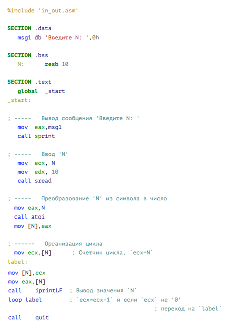

Создадим исполняемый файл и проверим его работу (рис. 3).

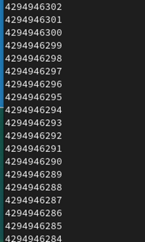

Данный пример показывает, что использование регистра ecx в теле цилка
loop может привести к некорректной работе программы. Изменим текст
программы добавив изменение значение регистра ecx в цикле по следующему
примеру (рис. 4).

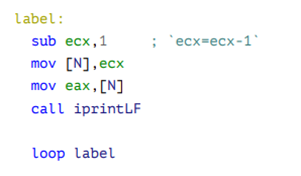

Создадим исполняемый файл и проверим его работу (рис. 5).

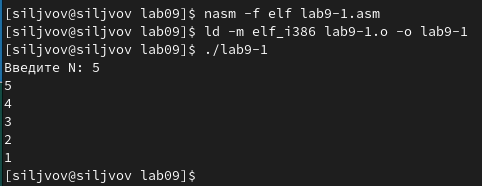

Как видим, все работает. Регистр ecx принимает все значения от N до 1
включительно, что соответствует числу проходов цикла, введенному с
клавиатуры.

Для использования регистра ecx в цикле и сохранения корректности работы
программы можно использовать стек. Внесем изменения в текст программы по
примеру, добавив команды push и pop (добавления в стек и извлечения из
стека) для сохранения значения счетчика цикла loop (рис. 6).

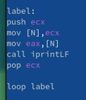

Создадим исполняемый файл и проверим его работу (рис. 7).

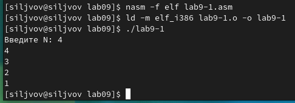

Программа работает корректно, число проходов цикла
соответствует значению N, введенному с клавиатуры.

**Обработка аргументов командной строки.**

При разработке программ иногда встает необходимость указывать аргументы,
которые будут использоваться в программе, непосредственно из командной
строки при запуске программы. При запуске программы в NASM аргументы
командной строки загружаются в стек в обратном порядке, кроме того, в
стек записывается имя программы и общее количество аргументов. Последние
два элемента стека для программы, скомпилированной NASM, -- это всегда
имя программы и количество переданных аргументов. Таким образом, для
того чтобы использовать аргументы в программе, их просто нужно извлечь
из стека. Обработку аргументов нужно проводить в цикле. Т.е. сначала
нужно извлечь из стека количество аргументов, а затем циклично для
каждого аргумента выполнить логику программы. В качестве примера
рассмотрим программу, которая выводит на экран аргументы командной
строки (рис. 8). Создадим в каталоге лабораторной работы №9 файл lab9-2
и введем текст из рис. 8.

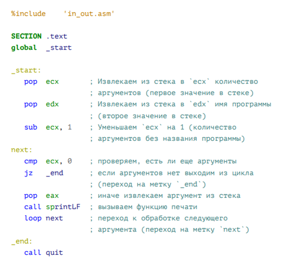

Затем создадим исполняемый файл и запустим программу, указав следующие
аргументы (рис. 9).

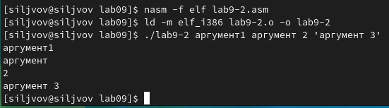

Программа восприняла "аргумент" и "2" как отдельные аргументы, в то
время как 'аргумент 3' как один. Соответственно программой было
обработано 4 аргумента.

Рассмотрим еще один пример программы, которая выводит сумму чисел,
которые передаются в программу как аргументы. Создадим файл lab9-3.asm в
том же каталоге и введем в него следующий текст программы (рис. 10).

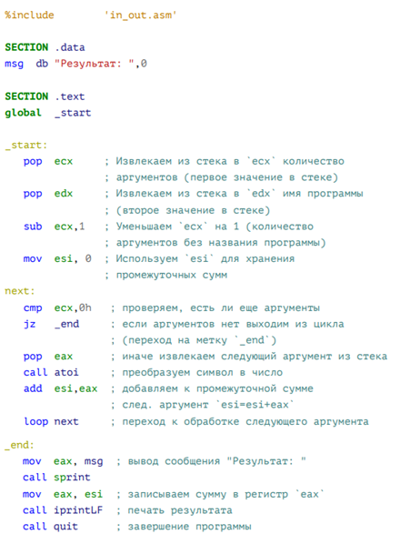

Затем создадим исполняемый файл и запустим его, указав аргументы (рис.
11).

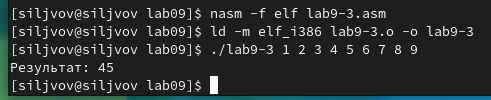

Все работает корректно.

Изменим строку

*add esi,ecx*

на

*mov ebx, eax*

*mov eax, esi*

*mul ecx*

*mov esi, eax*

а также присвоим esi значение 1, чтобы программа выводила произведение
аргументов командной строки и запустим ее (рис. 12).

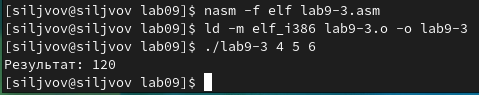

# Порядок выполнения самостоятельной работы:

Напишем программу lab9-4, которая находит сумму значений функции 𝑓(𝑥)
для 𝑥 = 𝑥1, 𝑥2,..., 𝑥𝑛, т.е. программа должна выводить значение 𝑓(𝑥1)
+ 𝑓(𝑥2)+...+𝑓(𝑥𝑛). Значения 𝑥𝑖 передаются как аргументы. Вид функции
𝑓(𝑥) выберем в соответствии с вариантом, полученным при выполнении
лабораторной работы № 7 (вариант 14). Создадим исполняемый файл и
проверим его работу на нескольких наборах 𝑥 = 𝑥1, 𝑥2,..., 𝑥𝑛.

f (x)= 7(x + 1)

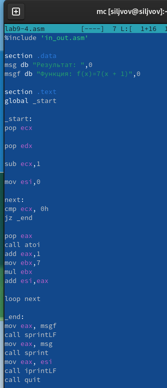

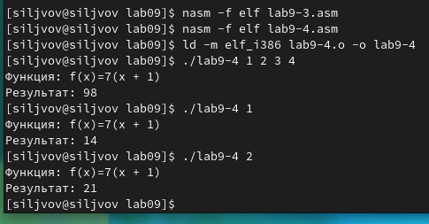

# Вывод:

Во время выполнения лабораторной работы были приобретены навыки
написания программ с использованием циклов и обработкой аргументов
командной строки.
