**РОССИЙСКИЙ УНИВЕРСИТЕТ ДРУЖБЫ НАРОДОВ**

**Факультет физико-математических и естественных наук**

**Кафедра прикладной информатики и теории вероятностей**

**ОТЧЕТ**

**по лабораторной работе № [10]{.underline}**

*[дисциплина: Архитектура компьютера]{.underline}*

[Студент: Львов Сергей]{.underline}

Группа: НПИбд-02-22

**МОСКВА**

2022 г.

**Цель работы:**

Приобретение навыков написания программ с использованием подпрограмм.
Знакомство с методами отладки при помощи GDB и его основными
возможностями.

**Порядок выполнения лабораторной работы:**

**Реализация подпрограмм в NASM.**

Создадим каталог для выполнения лабораторной работы № 10, перейдем в
него и создадим файл lab10-1.asm:

mkdir \~/work/arch-pc/lab10

cd \~/work/arch-pc/lab10

touch lab10-1.asm

В качестве примера рассмотрим программу вычисления арифметического
выражения 𝑓(𝑥) = 2𝑥 + 7 с помощью подпрограммы \_calcul. В данном
примере 𝑥 вводится с клавиатуры, а само выражение вычисляется в
подпрограмме(рис. 1-3).

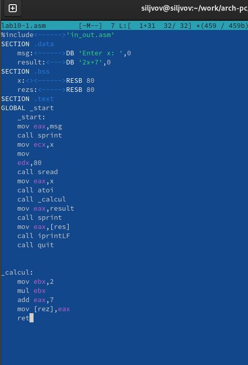{width="5.082697944006999in"
height="7.4886472003499565in"}

Рис. 1. Пример программы с использованием вызова подпрограммы

Первые строки программы отвечают за вывод сообщения на экран (call
sprint), чтение данных введенных с клавиатуры (call sread) и
преобразования введенных данных из символьного вида в численный (call
atoi).

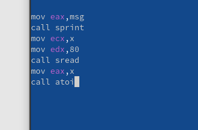{width="3.405824584426947in"
height="2.239303368328959in"}

Рис. 2. Пример программы с использованием вызова подпрограммы

После следующей инструкции call \_calcul, которая передает управление
подпрограмме \_calcul, будут выполнены следующие инструкции подпрограммы
(рис. 3).

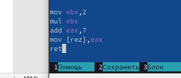{width="3.707869641294838in"
height="1.5935509623797026in"}

Рис. 3. Пример программы с использованием вызова подпрограммы

Инструкция ret является последней в подпрограмме и ее исполнение
приводит к возвращению в основную программу к инструкции, следующей за
инструкцией call, которая вызвала данную подпрограмму. Последние строки
программы реализуют вывод сообщения (call sprint), результата вычисления
(call iprintLF) и завершение программы (call quit). Введите в файл
lab10-1.asm текст программы из листинга 10.1. Создайте исполняемый файл
и проверьте его работу. Измените текст программы, добавив подпрограмму
\_subcalcul в подпрограмму \_calcul, для вычисления выражения 𝑓(𝑔(𝑥)),
где 𝑥 вводится с клавиатуры, 𝑓(𝑥) = 2𝑥 + 7, 𝑔(𝑥) = 3𝑥 − 1. Т.е. 𝑥
передается в подпрограмму \_calcul из нее в подпрограмму \_subcalcul,
где вычисляется выражение 𝑔(𝑥), результат возвращается в \_calcul и
вычисляется выражение 𝑓(𝑔(𝑥)). Результат возвращается в основную
программу для вывода результата на экран.

**Отладка программам с помощью GDB.**

Создадим файл lab10-2.asm с текстом программы из рис. 4 (Программа
печати сообщения Hello world!).

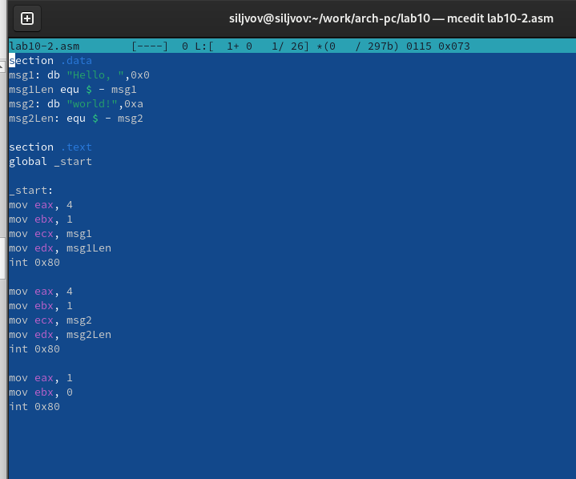{width="6.728472222222222in"
height="5.595833333333333in"}

Рис. 4. Текст программы печати сообщения Hello world!

Получим исполняемый файл. Для работы с GDB в исполняемый файл необходимо
добавить отладочную информацию, для этого трансляцию программ необходимо
проводить с ключом '-g'. Затем загрузим исполняемый файл в отладчик
gdb.И проверим работу программы, запустив ее в оболочке GDB с помощью
команды run (сокращённо r) (рис. 5).

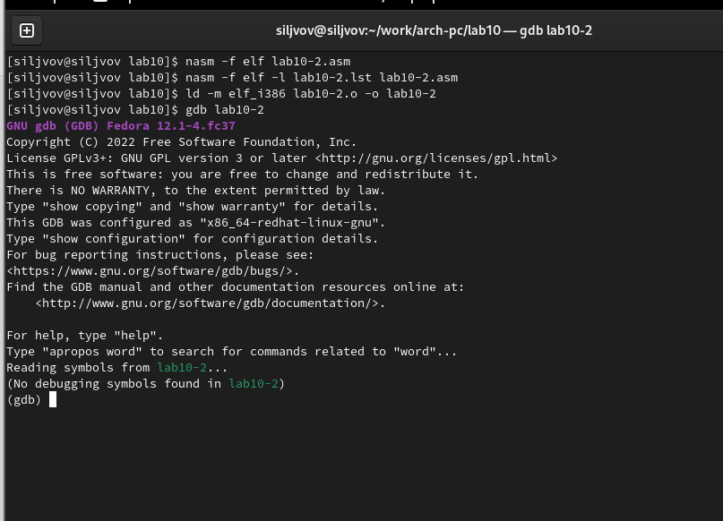{width="6.728472222222222in"
height="4.852083333333334in"}

Рис. 5. Результат работы программы

Для более подробного анализа программы установим брейкпоинт на метку
\_start, с которой начинается выполнение любой ассемблерной программы, и
запустим её (рис. 6).

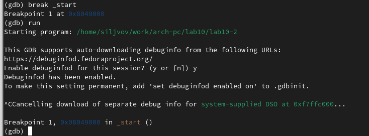{width="6.728472222222222in"
height="2.484027777777778in"}

Рис. 6. Breakpoint

Посмотрим дисассимилированный код программы с помощью команды
disassemble, начиная с метки \_start (рис. 7).

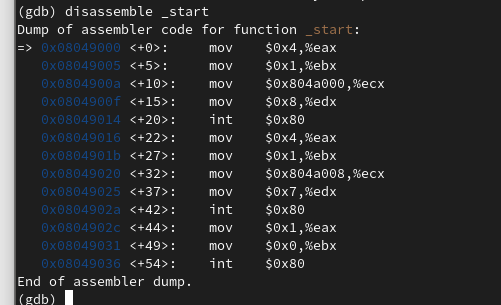{width="5.218098206474191in"
height="3.176686351706037in"}

Рис. 7. Дисассимилированный код программы

Переключимся на отображение команд с Intel'овским синтаксисом, введя
команду set disassembly-flavor intel (рис. 8).

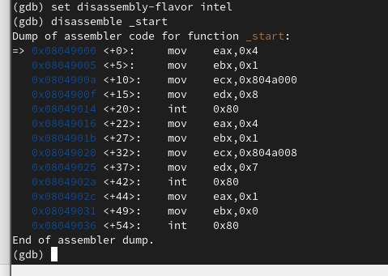{width="4.988959973753281in"
height="3.5516393263342083in"}

Рис. 8. Дисассимилированный код программы

Включим режим псевдографики для более удобного анализа программы (рис.
9).

(gdb) layout asm

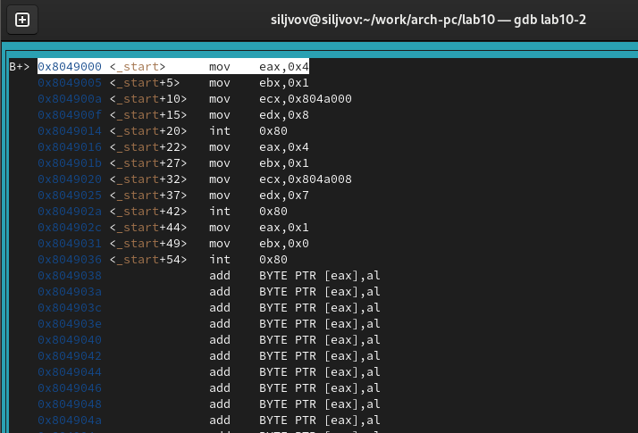{width="6.728472222222222in"
height="4.570833333333334in"}

(gdb) layout regs

{width="5.833333333333333in"
height="4.2706747594050745in"}

Рис. 9. Режим псевдографики

**Добавление точек останова.**

Установить точку останова можно командой break (кратко b). Типичный
аргумент этой команды --- место установки. Его можно задать или как
номер строки программы (имеет смысл, если есть исходный файл, а
программа компилировалась с информацией об отладке), или как имя метки,
или как адрес. Чтобы не было путаницы с номерами, перед адресом ставится
«звёздочка».

На предыдущих шагах была установлена точка останова по имени метки
(\_start). Проверим это с помощью команды info breakpoints (кратко i b)
(рис. 10).

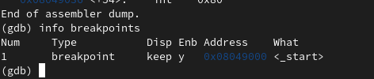{width="4.916052055993001in"
height="1.0415365266841645in"}

Рис. 10. Точка останова \_start

Установим еще одну точку останова по адресу инструкции. Адрес инструкции
можно увидеть в средней части экрана в левом столбце соответствующей
инструкции. Определим адрес предпоследней инструкции (mov ebx,0x0),
установим точку останова и посмотрим информацию о всех установленных
точках останова (рис. 11).

{width="5.833333333333333in"
height="5.868956692913386in"}

Рис. 11. Задание

**Работа с данными программы в GDB.**

Отладчик может показывать содержимое ячеек памяти и регистров, а при
необходимости позволяет вручную изменять значения регистров и
переменных. Выполним 5 инструкций с помощью команды stepi (или si) и
проследите за изменением значений регистров.

Для отображения содержимого памяти можно использовать команду x ,
которая выдаёт содержимое ячейки памяти по указанному адресу. Формат, в
котором выводятся данные, можно задать после имени команды через косую
черту: x/NFU . С помощью команды x & также можно посмотреть содержимое
переменной. Посмотрим значение переменной msg1 по имени (рис. 12)

(gdb) x/1sb &msg1

0x804a000 : \"Hello, \"

{width="2.378946850393701in"
height="0.8210520559930009in"}

Рис. 12. Значение переменной msg1

Посмотрим значение переменной msg2 по адресу. Адрес переменной можно
определить по дизассемблированной инструкции. Посмотрим инструкцию mov
ecx,msg2 которая записывает в регистр ecx адрес перемененной msg2

{width="2.378946850393701in"
height="1.0421052055993in"}

Рис. 13. Значение переменной msg2

Изменить значение для регистра или ячейки памяти можно с помощью команды
set, задав ей в качестве аргумента имя регистра или адрес. При этом
перед именем регистра ставится префикс \$, а перед адресом нужно указать
в фигурных скобках тип данных (размер сохраняемого значения; в качестве
типа данных можно использовать типы языка Си). Изменим первый символ
переменной msg1 (рис. 14).

{width="2.5894728783902012in"
height="0.9578937007874015in"}

Рис. 14. Примеры использования команды set

**Обработка аргументов командной строки в GDB.**

Скопируем файл lab9-2.asm, созданный при выполнении лабораторной работы
№9, с программой выводящей на экран аргументы командной строки в файл с
именем lab10-3.asm:

cp \~/work/arch-pc/lab09/lab9-2.asm \~/work/arch-pc/lab10/lab10-3.asm

Создадим исполняемый файл:

nasm -f elf -g -l lab10-3.lst lab10-3.asm

ld -m elf_i386 lab10-3.o -o lab10-3

Для загрузки в gdb программы с аргументами необходимо использовать ключ
\--args. Загрузим исполняемый файл в отладчик, указав аргументы:

gdb \--args lab10-3 аргумент1 аргумент 2 \'аргумент 3\'

Для начала установим точку останова перед первой инструкцией в программе
и запустим ее.

(gdb) b \_start

(gdb) run

Адрес вершины стека храниться в регистре esp и по этому адресу
располагается число равное количеству аргументов командной строки
(включая имя программы):

(gdb) x/x \$esp

0xffffd200: 0x05

Как видно, число аргументов равно 5 -- это имя программы lab10-3 и
непосредственно аргументы: аргумент1, аргумент, 2 и \'аргумент 3\'

**Порядок выполнения самостоятельной работы:**

На рис. 15 приведена программа вычисления выражения (3+ 2) ∗ 4+ 5. При
запуске данная программа дает неверный результат. Проверьте это. С
помощью отладчика GDB, анализируя изменения значений регистров,
определите ошибку и исправьте ее.

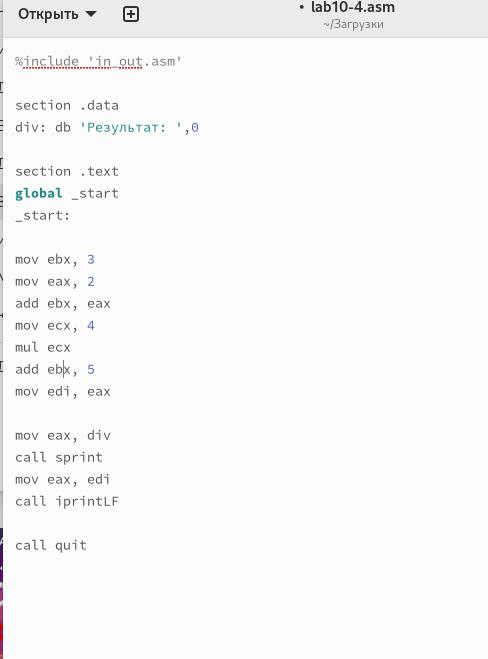{width="3.839709098862642in"
height="5.1851804461942255in"}

Рис. 15. Программа с ошибкой

Проверим работу программы (рис. 16), как видим, она работает
неправильно.

{width="5.833333333333333in"
height="1.4695177165354332in"}

Рис. 16. Результат работы программы

Установим брейкпоинт на метку \_start и посмотрим дисассимилированный
код программы с помощью команды disassemble начиная с метки \_start
(рис. 17).

{width="4.452631233595801in"
height="2.9157884951881017in"}

Рис. 17. Код программы

Как видим в строке по адресу 0x080490f2 происходи сложение регистров eax
и eax и перемещение результата в регистр ebx, а затем в строке с адресом
0x080490f9 мы умножаем значения регистров eax и ecx и перемещаем
результат в регистр eax, соотвественно в итоге в строке с адресом
0x080490fb мы к значению регистра ebx прибавляем 5, но умножение не
учитывалось, поэтому ответ будет неверным. В строке с адресом 0x080490f2
значение регистра eax должно быть равно 5. Поменяем местами регистры eax
и ebx в этой строке и запишем в ответ edi значение регистра eax,
запустим программу (рис. 18-19).

{width="4.895220909886264in"
height="6.92621719160105in"}

Рис. 18. Код программы

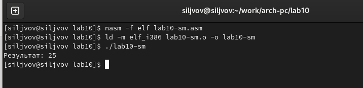{width="6.728472222222222in"
height="1.6347222222222222in"}

Рис. 19. Результат работы программы

**Вывод:**

Во время выполнения лабораторной работы были приобретены навыки
написания программ с использованием подпрограмм. Также были изучены
методы отладки при помощи GDB и его основные возможности.
