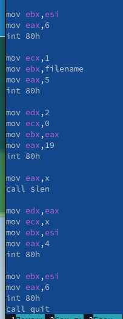

---
## Front matter
title: "Отчёт по лабораторной работе 11"
subtitle: "Работа с файлами средствами NASM"
author: "Львов Сергей	НПИбд-02-22"

## Generic otions
lang: ru-RU
toc-title: "Содержание"

## Bibliography
bibliography: bib/cite.bib
csl: pandoc/csl/gost-r-7-0-5-2008-numeric.csl

## Pdf output format
toc: true # Table of contents
toc-depth: 2
lof: true # List of figures
lot: true # List of tables
fontsize: 12pt
linestretch: 1.5
papersize: a4
documentclass: scrreprt
## I18n polyglossia
polyglossia-lang:
  name: russian
  options:
	- spelling=modern
	- babelshorthands=true
polyglossia-otherlangs:
  name: english
## I18n babel
babel-lang: russian
babel-otherlangs: english
## Fonts
mainfont: PT Serif
romanfont: PT Serif
sansfont: PT Sans
monofont: PT Mono
mainfontoptions: Ligatures=TeX
romanfontoptions: Ligatures=TeX
sansfontoptions: Ligatures=TeX,Scale=MatchLowercase
monofontoptions: Scale=MatchLowercase,Scale=0.9
## Biblatex
biblatex: true
biblio-style: "gost-numeric"
biblatexoptions:
  - parentracker=true
  - backend=biber
  - hyperref=auto
  - language=auto
  - autolang=other*
  - citestyle=gost-numeric
## Pandoc-crossref LaTeX customization
figureTitle: "Рис."
tableTitle: "Таблица"
listingTitle: "Листинг"
lofTitle: "Список иллюстраций"
lotTitle: "Список таблиц"
lolTitle: "Листинги"
## Misc options
indent: true
header-includes:
  - \usepackage{indentfirst}
  - \usepackage{float} # keep figures where there are in the text
  - \floatplacement{figure}{H} # keep figures where there are in the text
---

# Цель работы:

Приобретение навыков написания программ для работы с файлами.

# Порядок выполнения лабораторной работы:

Создадим каталог для программ лабораторной работы № 11, перейдем в него
и создадим файлы lab11-1.asm и readme.txt (рис. 1).

Введем в файл lab11-1.asm текст программы (рис. 2). Создадим исполняемый
файл и проверим его работу (рис. 3).

С помощью команды chmod ugo-x изменим права доступа к исполняемому файлу
lab11-1, запретив его выполнение, затем попытаемся выполнить исполняемый
файл (рис. 4).

Теперь невозможно запустить файл из-за отказа в доступе (ugo отвечает за
выбор принадлежности прав, в нашем случае это все пользователи, -
отвечает за отмену прав, а x отвечает за право на исполнение).

Затем с помощью команды chmod изменим права доступа к файлу lab11-1.asm
с исходным текстом программы, добавив права на исполнение и попытаемся
запустить его (рис. 5).

Эти ошибки вызваны тем, что мы запустили на выполнение не исполняемый
файл.

Теперь предоставим права доступа к файлу readme.txt в соответствии с
вариантом, данном в ЛР 11 (14 вариант). В данном случае набор прав
доступа в символьном виде будет следующим: r-x rwx rwx. И проверим корректность выполнения (рис. 6).

# Порядок выполнения самостоятельной работы:

Напишем программу (рис. 7-8), которая будет работать по следующему
алгоритму:

1)  Вывод приглашения "Как Вас зовут?"

2)  Ввод с клавиатуры своих фамилии и имени.

3)  Создание файла с именем name.txt.

4)  Запись в файл сообщения "Меня зовут".

5)  Дополнительная запись в файл строки, введенной с клавиатуры.

6)  Закрытие файла.

Создадим исполняемый файл и проверим его работу. Затем проверим наличие
файла и его содержимое с помощью команд ls и cat (рис. 9).

# Вывод:

В ходе выполнения лабораторной работы были приобретены навыки написания
программ для работы с файлами.
